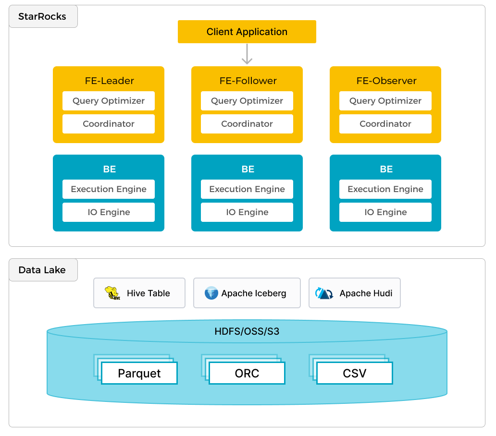
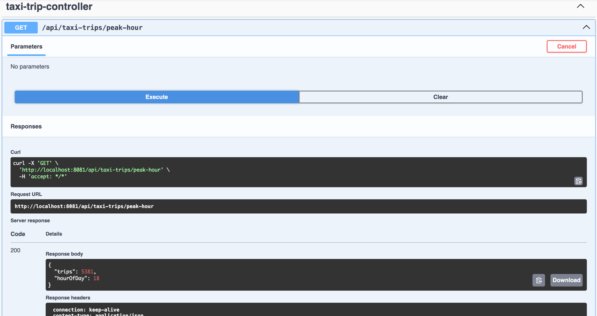

#  Data Lake Lightning: Turbocharged NYC Taxi Insights with Iceberg, StarRocks, and Spring Boot

## Overview
A comprehensive Spring Boot application for analyzing NYC Green Taxi trip data using Apache Iceberg, StarRocks, and MinIO.

## Prerequisites
- Docker
- Docker Compose
- curl
- Java 17+
- Maven



## Data Preparation and Infrastructure Setup

### 1. Download Dataset
```bash
# Download NYC Green Taxi dataset
curl -O https://raw.githubusercontent.com/StarRocks/demo/master/documentation-samples/iceberg/datasets/green_tripdata_2023-05.parquet
```

### 2. Start Docker Compose Infrastructure
```bash
# Start required services
docker-compose up -d

# Verify services are running
docker-compose ps
```

Expected services:
- Rest service
- MinIO
- Spark Iceberg
- StarRocks (Frontend and Backend)

### 3. Copy Dataset to Spark Container
```bash
docker cp green_tripdata_2023-05.parquet spark-iceberg:/opt/spark/
```

### 4. Process Dataset in PySpark
```bash
# Enter PySpark shell
docker exec -it spark-iceberg pyspark

# Read and process Parquet file
df = spark.read.parquet("/opt/spark/green_tripdata_2023-05.parquet")

# Create Iceberg table
df.writeTo("demo.nyc.greentaxis").create()
```

### 5. Configure StarRocks External Catalog
```sql
# Connect to StarRocks MySQL interface
docker-compose exec starrocks-fe mysql -P 9030 -h 127.0.0.1 -u root

# Create External Iceberg Catalog
CREATE EXTERNAL CATALOG 'iceberg'
COMMENT "External catalog to Apache Iceberg on MinIO"
PROPERTIES
(
  "type"="iceberg",
  "iceberg.catalog.type"="rest",
  "iceberg.catalog.uri"="http://iceberg-rest:8181",
  "iceberg.catalog.warehouse"="warehouse",
  "aws.s3.access_key"="admin",
  "aws.s3.secret_key"="password",
  "aws.s3.endpoint"="http://minio:9000",
  "aws.s3.enable_path_style_access"="true",
  "client.factory"="com.starrocks.connector.iceberg.IcebergAwsClientFactory"  
);

# Switch to Iceberg Catalog
SET CATALOG iceberg;
USE nyc;
```

## Application Configuration

### Application Properties
```properties
server.port=8081
spring.threads.virtual.enabled=true

springdoc.swagger-ui.path=/swagger-ui.html

spring.datasource.url=jdbc:mysql://127.0.0.1:9030/iceberg.nyc
spring.datasource.username=root
spring.datasource.password=
spring.datasource.driver-class-name=com.mysql.cj.jdbc.Driver

# JPA Configuration
spring.jpa.hibernate.ddl-auto=none
spring.jpa.show-sql=true
spring.jpa.properties.hibernate.dialect=org.hibernate.dialect.MySQLDialect
spring.jpa.properties.hibernate.format_sql=true

# Logging configurations
logging.level.org.hibernate.SQL=DEBUG
logging.level.org.hibernate.type.descriptor.sql.BasicBinder=TRACE
```

## Key Technical Components
- Apache Iceberg for data lake
- StarRocks as query engine
- MinIO as object storage
- Spring Boot with virtual threading
- PySpark for data processing

## Running the Application
```bash
# Build the project
./mvnw clean package

# Run Spring Boot application
./mvnw spring-boot:run
```

### Access Points
- Swagger UI: `http://localhost:8081/swagger-ui.html`
- API Endpoints: `http://localhost:8081/api/taxi-trips/`



## Dataset Schema
- 20 columns capturing taxi trip details
- Timestamp-based pickup and dropoff times
- Location IDs
- Trip metrics (distance, fare, passenger count)
- Payment and trip type information

## Troubleshooting
- Ensure all Docker services are running
- Verify network connectivity
- Check StarRocks and Iceberg catalog configurations
- Validate dataset loading